# Email Spoofing & Phishing Simulation — Custom Mail Server + SET

**Environment:** Fully local lab (VirtualBox/VMware, isolated network)
**Category:** Social Engineering, Email Infrastructure, Phishing Simulation
**Disclaimer:** This project was built entirely in a local, isolated lab for educational purposes. No real domains, real users, or production systems were targeted at any point.

---

## Summary

This project simulates a realistic phishing campaign end-to-end: a fully functional mail server was built from scratch to send convincing spoofed email, paired with a cloned phishing landing page to harvest credentials — replicating the two core components of a real-world business email compromise / credential phishing attack.

Two virtual machines were used:

| Role | Host | IP |
|---|---|---|
| Attacker (Parrot OS) | — | `192.168.1.9` |
| Mail Server (Ubuntu Server) | `mail.fakefacebook.com` | `192.168.1.8` |
| Victim (Ubuntu Desktop) | — | `192.168.1.10` |

**Attack chain:**
1. Stood up a complete SMTP/IMAP mail infrastructure (Postfix + Dovecot + BIND9 + Roundcube) under a fake domain, `fakefacebook.com`.
2. Used the **Social Engineer Toolkit (SET)** to clone Facebook's login page and host it on the attacker machine.
3. Crafted an HTML phishing email impersonating a "Facebook friend request" notification, sent from the spoofed domain.
4. Delivered it to the victim's mailbox via Roundcube webmail.
5. Victim clicks the embedded link → lands on the cloned Facebook login page → enters credentials → **SET captures them in plaintext on the attacker machine.**

---

## 1. Mail Server Infrastructure

To make the phishing email land in a real mailbox and appear to originate from a legitimate-looking domain, a full mail stack was built rather than relying on a third-party SMTP relay.

### 1.1 Postfix — SMTP (Mail Transfer Agent)

Postfix handles routing, delivery, and receipt of mail. During installation, the **System Mail Name** was set to define the domain identity of outgoing mail — later matched to the BIND9 zone configured for the same domain.

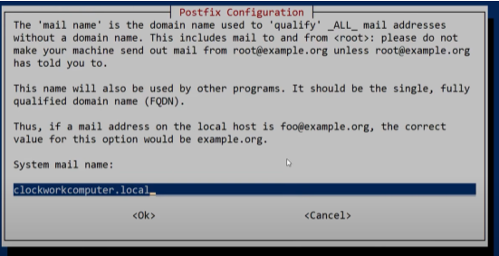

Key directives in `/etc/postfix/main.cf`:

```
myhostname = fakefacebook.com
myorigin = /etc/mailname
inet_interfaces = all
inet_protocols = all

mydestination = $myhostname, $mydomain, localhost, fakefacebook.com, smtp.fakefacebook.com, www.fakefacebook.com
mynetworks = 127.0.0.0/8 [::ffff:127.0.0.0]/104 [::1]/128 192.168.1.0/24
smtpd_relay_restrictions = permit_mynetworks permit_sasl_authenticated defer_unauth_destination

smtpd_tls_security_level = may
smtpd_tls_cert_file=/etc/ssl/certs/ssl-cert-snakeoil.pem
smtpd_tls_key_file=/etc/ssl/private/ssl-cert-snakeoil.key

home_mailbox = Maildir/
```

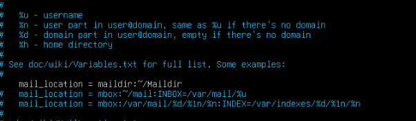

`mynetworks` was scoped to the lab subnet (`192.168.1.0/24`) to keep relay permissions contained to the lab, and `home_mailbox = Maildir/` was set so each user's mail lands in Maildir format — required for Dovecot to serve it via IMAP/POP3 afterward.

### 1.2 Dovecot — IMAP/POP3 (Mail Delivery & Storage)

Dovecot was layered on top of Postfix to allow Roundcube (and any IMAP/POP3 client) to actually read and store mail per-user, rather than relying on raw mbox access.

```
mail_location = maildir:~/Maildir
```

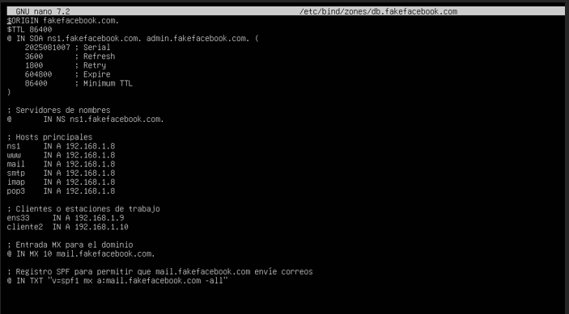

This was configured in `/etc/dovecot/conf.d/10-mail.conf` to match the `Maildir/` format Postfix was writing to.

### 1.3 BIND9 — DNS

This was the most fragile part of the build. A custom DNS zone was authored for `fakefacebook.com`, defining the records needed for mail routing and web access to resolve entirely within the lab network:

```bind
$ORIGIN fakefacebook.com.
$TTL 86400
@ IN SOA ns1.fakefacebook.com. admin.fakefacebook.com. (
    2025081007 ; Serial
    3600       ; Refresh
    1800       ; Retry
    604800     ; Expire
    86400 )    ; Minimum TTL

; Name servers
@       IN NS   ns1.fakefacebook.com.

; Core hosts
ns1     IN A    192.168.1.8
www     IN A    192.168.1.8
mail    IN A    192.168.1.8
smtp    IN A    192.168.1.8
imap    IN A    192.168.1.8
pop3    IN A    192.168.1.8

; Clients / workstations
ens33   IN A    192.168.1.9
cliente2 IN A   192.168.1.10

; MX record for the domain
@ IN MX 10 mail.fakefacebook.com.

; SPF record permitting mail.fakefacebook.com to send mail
@ IN TXT "v=spf1 mx a:mail.fakefacebook.com -all"
```

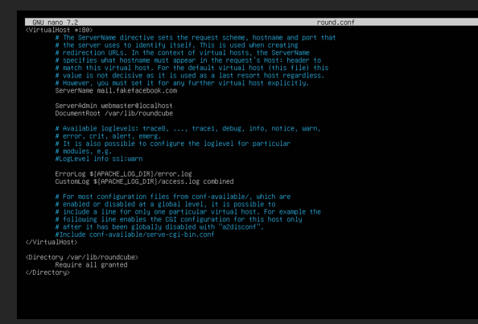

The **MX record** tells any resolver that mail for `fakefacebook.com` should route to `mail.fakefacebook.com`, and the **SPF record** was added so the domain itself appears to authorize that mail server to send on its behalf — a detail real attackers sometimes configure to reduce the chance of landing in spam.

### 1.4 Validating the Mail Path

Before introducing the GUI layer, raw command-line mail was used to confirm Postfix could send and receive correctly between local accounts:

```bash
mail alice
Subject: prueba
es una prueba
Cc: bob@fakefacebook.com
```

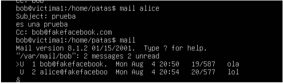

### 1.5 Apache + Roundcube — Webmail Interface

A graphical webmail client (Roundcube) was added for realism and ease of use — mail server access via raw CLI is not how a real phishing target would interact with their inbox.

Apache virtual host (`/etc/apache2/sites-available/round.conf`):

```apache
<VirtualHost *:80>
    ServerName mail.fakefacebook.com
    ServerAdmin webmaster@localhost
    DocumentRoot /var/lib/roundcube
    ErrorLog ${APACHE_LOG_DIR}/error.log
    CustomLog ${APACHE_LOG_DIR}/access.log combined
</VirtualHost>

<Directory /var/lib/roundcube>
    Require all granted
</Directory>
```

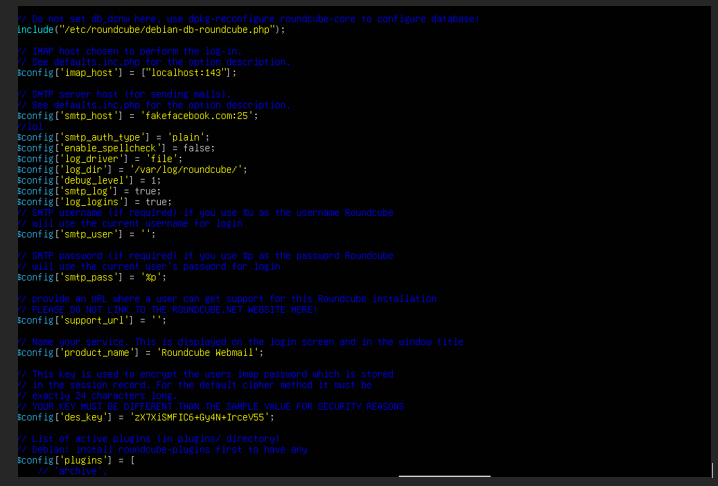

Roundcube was then pointed at the local Postfix instance in `config.inc.php`:

```php
$config['imap_host'] = ['localhost:143'];
$config['smtp_host'] = 'fakefacebook.com:25';
$config['smtp_user'] = '%u';
$config['smtp_pass'] = '%p';
```

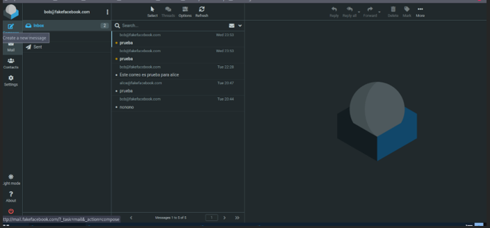

Port `25` (standard unencrypted SMTP submission) was used since the lab's Postfix instance does not enforce SMTPS; a production setup would use port `465` or `587` with TLS instead.

**Result — fully functional webmail accessible at `mail.fakefacebook.com`:**

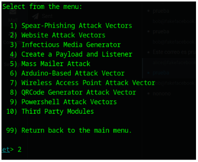

---

## 2. Phishing Page — Social Engineer Toolkit (SET)

With a working mail delivery path in place, the next step was the actual credential-harvesting payload: a cloned Facebook login page.

### 2.1 Selecting the Attack Vector

SET's main menu was used to select **Website Attack Vectors**, then **Credential Harvester Attack Method**, which serves a cloned page and logs any form submission to it.


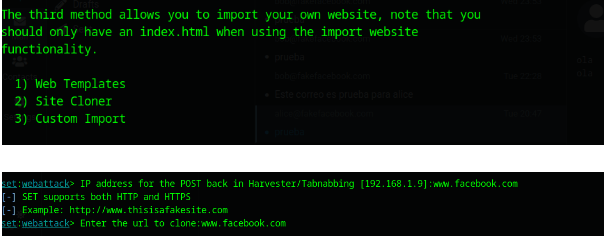

### 2.2 Cloning the Target Page

The **Site Cloner** option was used to pull a live copy of Facebook's login page, configuring the attacker IP (`192.168.1.9`) as the address that captured credentials POST back to:

```
[-] IP address for the POST back in Harvester/Tabnabbing [192.168.1.9]:www.facebook.com
[-] Enter the url to clone:www.facebook.com
```

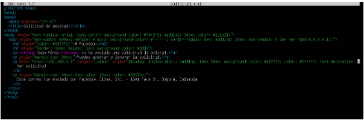

SET then hosts an exact visual replica of the real Facebook login page on the attacker's machine, with the underlying form action silently rewritten to submit to the attacker's listener instead of Facebook's real servers.

---

## 3. Phishing Email — Delivery

### 3.1 Crafting the Lure

An HTML email was built to impersonate a Facebook "friend request" notification — a low-friction, plausible pretext that creates curiosity without raising suspicion the way an urgent security alert might.

```html
<!DOCTYPE html>
<html>
<head>
  <meta charset="UTF-8">
  <title>Solicitud de amistad</title>
</head>
<body style="font-family: Arial, sans-serif; background-color: #f0f2f5; padding: 20px;">
  <div style="max-width: 600px; margin: 0 auto; background-color: #ffffff; border-radius: 8px; padding: 20px;">
    <h2 style="color: #1877f2;">facebook</h2>
    <p><strong>Juan Pérez</strong> te ha enviado una solicitud de amistad.</p>
    <a href="http://192.168.1.9" target="_blank"
       style="display:inline-block; padding:10px 20px; background-color:#1877f2; color:#ffffff;
              text-decoration:none; border-radius:6px; font-weight:bold;">
      Ver solicitud
    </a>
    <p style="margin-top: 40px; font-size: 12px; color: #65676b;">
      Este correo fue enviado por Facebook Clone, Inc. — 1601 Fake St, Bogotá, Colombia
    </p>
  </div>
</body>
</html>
```

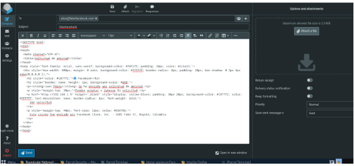

The embedded link points directly to the attacker's IP (`192.168.1.9`), where SET's cloned page is listening.

### 3.2 Sending via Roundcube

The email was composed and sent through the legitimate-looking webmail interface, from `alice@fakefacebook.com`:


### 3.3 Sending via Command Line (Alternative Method)

The same HTML payload was also sent directly through Postfix using `mailx`, demonstrating that delivery does not depend on the GUI client:

```bash
cat solicitud.html | mailx -a "Content-Type: text/html" -s "Nueva solicitud de amistad" alice@fakefacebook.com
```

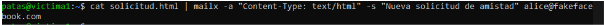

### 3.4 Victim's View

From the victim's mailbox, the email renders as a convincing Facebook notification, indistinguishable at a glance from a legitimate one:

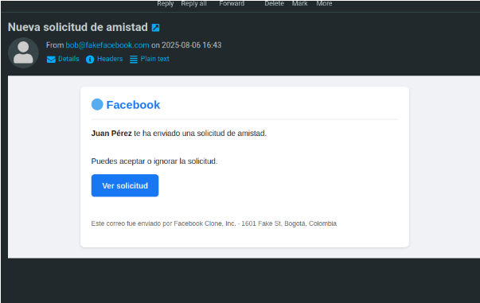

---

## 4. Credential Harvesting

When the victim clicks **"Ver solicitud,"** they are taken to SET's cloned Facebook login page — a pixel-identical replica hosted on the attacker's machine:

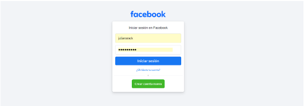

Once the victim enters their username and password and submits the form, SET intercepts the POST request server-side and logs the credentials in plaintext to the attacker's terminal — completing the attack chain from email delivery to credential theft.

---

## 5. Attack Chain Summary

| Stage | Component | Purpose |
|---|---|---|
| 1 | Postfix + BIND9 + SPF record | Establish a domain capable of sending mail that passes basic legitimacy checks |
| 2 | Dovecot + Roundcube | Realistic webmail delivery and victim-side mailbox experience |
| 3 | SET — Site Cloner | Produce a visually identical credential-harvesting login page |
| 4 | HTML phishing email | Low-friction social engineering pretext (friend request) to drive clicks |
| 5 | SET — Credential Harvester | Capture submitted credentials in plaintext |

## 6. Detection & Defense Notes

Building this lab end-to-end also surfaced the exact signals defenders should look for:

1. **SPF/DKIM/DMARC enforcement.** This lab's domain published an SPF record permitting its own server to send — in the real world, the *receiving* domain (e.g., the real facebook.com) has no relationship to an attacker-registered look-alike domain, so strict SPF/DKIM/DMARC alignment checks on the receiving side would flag or reject spoofed mail from a domain like `fakefacebook.com` claiming to represent Facebook.
2. **Look-alike domain detection.** `fakefacebook.com` is a textbook typosquat/cousin-domain pattern. Mail filtering and brand-protection tooling specifically watch for domains that visually or semantically impersonate high-value brands.
3. **Link inspection before clicking.** The phishing link in this lab pointed to a raw IP address (`192.168.1.9`) rather than any `facebook.com` subdomain — a major red flag that's easy to teach end users to check (hover before you click).
4. **TLS certificate mismatch.** A cloned page hosted by an attacker will not have a valid certificate for the real brand's domain; user training and browser warnings are the primary control here.
5. **Credential harvester traffic patterns.** SET's cloned pages typically redirect to the real site after capture — but the page itself is served from infrastructure with no legitimate certificate or hosting history, which is detectable by URL reputation and sandboxing tools used in real SOC/MSSP environments.
6. **User reporting culture.** The single highest-leverage defense against this entire attack chain is a workforce trained to report suspicious "friend request" or notification-style emails rather than act on them — this is the control that actually breaks the chain before any technical control needs to.

---

## Tools Used

- **Postfix** — SMTP mail transfer agent
- **Dovecot** — IMAP/POP3 mailbox server
- **BIND9** — authoritative DNS for the spoofed domain
- **Roundcube** — webmail client (PHP/MySQL)
- **Apache2** — web server hosting Roundcube
- **Social Engineer Toolkit (SET)** — site cloning and credential harvesting
- **mailx** — command-line mail testing and delivery

## Skills Demonstrated

- End-to-end mail server infrastructure (SMTP, IMAP, DNS, MX/SPF records)
- DNS zone authoring and troubleshooting (BIND9)
- Social engineering / phishing campaign design and execution
- HTML email crafting for social engineering pretexts
- Credential harvesting mechanics and detection awareness
- Translating an offensive exercise into concrete defensive recommendations
